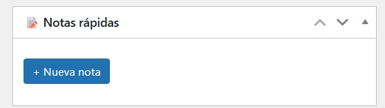
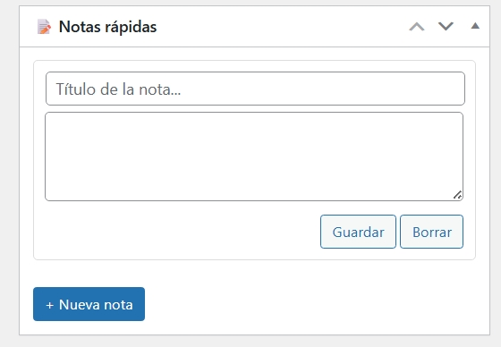

# Dashboard Quick Notes

Widget personalizado para el escritorio de WordPress que permite crear, editar y eliminar múltiples notas rápidas sin recargar la página (todo vía AJAX).

## Características
- Múltiples notas independientes
- Creación instantánea con botón "+ Nueva nota"
- Edición en tiempo real con feedback visual (Guardando... → Guardado ✓)
- Borrado con confirmación y animación
- Almacenamiento persistente con `update_option`
- Nonces y sanitización básica

## Instalación
1. Descarga o clona el repositorio
2. Sube la carpeta `wp-custom-dashboard-widgets` a `/wp-content/plugins/`
3. Activa el plugin desde el panel de WordPress

## Capturas (próximamente)
Estado inicial del widget (sin notas creadas):

Con una nota creada y lista para editar o borrar:

## Roadmap / ideas futuras
- Ordenar notas por fecha o manualmente (drag & drop)
- Notas privadas por usuario
- Colores / prioridad
- Minimizar / expandir notas

Licencia: GPL-2.0-or-later
